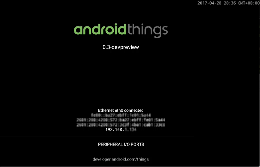

Overview
========

The Android Things First Device project is the prerequisite "hello world" project for noobs getting started with Android Things. The [Android Things documentation](https://developer.android.com/things) is really very good but I did run into a few things (no pun intended) that weren't exactly clear to me. My confusion could just be attributed to my naivete with electronics hardware. I'm not a total hardware neophyte but this is most certainly __not__ my area of expertise.

My intent with this project is to document some of the issues I ran into while creating this project, the answers and solutions I discovered and some of the customizations I tried.

Getting Started
===============

The [Android Things documentation](https://developer.android.com/things) is, in my opinion, very good. Getting started with Android Things development basically begins with selecting a hardware platform and that is also where the Android Things documentation begins.

While the "Hardware 101" section is a nice inclusion to the documentation, especially for a software developer with minimal hardware knowledge, I found this section a little premature. Selecting a development kit was my first priority. I didn't come back to this section until I was building the circuitry for this first project and had questions about the circuitry I was building. Developers with more electronics experience will undoubtedly find this information very basic but as a software developer I found the information very useful once I needed it.

All of the hardware opinions should be relatively equivalent for noobs just getting started with Android Things and Internet of Things (IoT). I chose the Raspberry Pi 3 B for my Android Things device because it's relatively inexpensive, it's ubiquitous within DIY and hobbiests communities and there's a lot of great information on all aspects of the Raspberry Pi on the internet.

One down-side to selecting the Raspberry Pi 3 is the inability of connecting to the Raspberry Pi via a USB connection. This isn't a problem as the Raspberry Pi has an Ethernet port and Wi-Fi but I like the idea of connecting [Android Debug Bridge](https://developer.android.com/studio/command-line/adb.html) directly to an Android device for development. This could be a non-issue and just a limitation of my knowledge about developing on the Raspberry Pi 3.

Hardware Set-up
---------------

#### Raspberry Pi 3 Set-up

Setting up the Raspberry Pi 3 with the Android Things OS was straightforward and easy. Just follow the [step-by-step instructions](https://developer.android.com/things/hardware/raspberrypi.html) in the Android Things documentation for Raspberry Pi 3.

One thing that wasn't clear to me was the size of the micro SD card to use. The Raspberry Pi 3 kit I purchased was the Vilros Raspberry Pi 3 Complete Starter Kit. This kit includes a 16GB micro SD imaged with the Raspbian OS. I wanted to preserve the image on this card and get a separate micro SD card for the Android Things OS. But what size to get? The Android Things documentation says to use an 8GB or larger micro SD card. But what is the maximum size supported by the Raspberry Pi 3? After a little investigation I found the Raspberry Pi 3 is compatible with a micro SD cards up to a maximum size of 32GB.

If everything went okay, and you've followed all the steps in the "Flashing the Image" section of the Android Things documentation, you should see the Android Things welcome screen.

If you've connected an Ethernet cable to your Raspberry Pi 3 you should see a block of text at the bottom of the screen with Ethernet connection information. __You need to connect the Raspberry Pi 3 to the a network, either with a cable or over Wi-Fi, to be able to communicate with the Raspberry Pi 3. Before you can connect to the Raspberry Pi 3 via Wi-Fi you need to connect an Ethernet cable in order to set-up the Wi-Fi service. Also, the Ethernet cable must be connected to the Raspberry Pi 3 prior to the Android Things OS booting.__ The OS doesn't see the network when the cable is plugged in after completing the boot process.

There is important IP address information on this screen that is needed to use with the ADB connect command. At the bottom of the welcome screen is a block of text that begins with "Ethernet eth0 connected". The last line in this block of text is the IP address of the Raspberry Pi 3. This IP address is needed to connect Android Studio to your Raspberry Pi 3.

__NOTE:__ I missed the note in the Android Things documentation the first time around about the Raspberry Pi 3 broadcasting the hostname __Android.local__ over Multicast DNS. This is a nice feature so you don't have to memorize an IP address that could change. I tried it on my network and was able to connect to my Raspberry Pi 3. Cool!

Connecting the Raspberry Pi 3 to your network by cable or over Wi-Fi is optional for this project. Either connection method is fine but the Raspberry Pi 3 must be connected to your network.

You can also skip the "Serial debug console" and "Configuring the UART mode" sections for this project as they are not needed.

#### Connecting the Hardware

For someone such as myself that's primarily a software developer this next step was my first challenge. I've customized my computers over the years, my first computer was an Apple ][+ (which I still have for sentimental reasons), I built a Windows PC from components, I've configured and set-up NAS servers, network routers and extenders and done a number of varied tasks over the years to get the most out of a variety of electronic devices but building circuits is something I haven't done for years.

The next step for this project is building the circuitry the Android Things app will interact with. While this is a __very__ simple circuit it was obvious I was going to need to do some research to come up to speed on how to build this circuit.

First, I needed to get the necessary electronic components. There are some great electronic parts supplier for DIYers and hobbiests. The two suppliers that I like are [adafruit](https://adafruit.com) and [sparkfun](https://sparkfun.com). I'm sure there are many more great suppliers but these are the two I found. Both have a ton of great information and tutorials. I especially like the tutorial videos on sparkfun.
